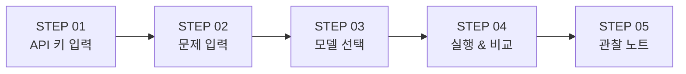
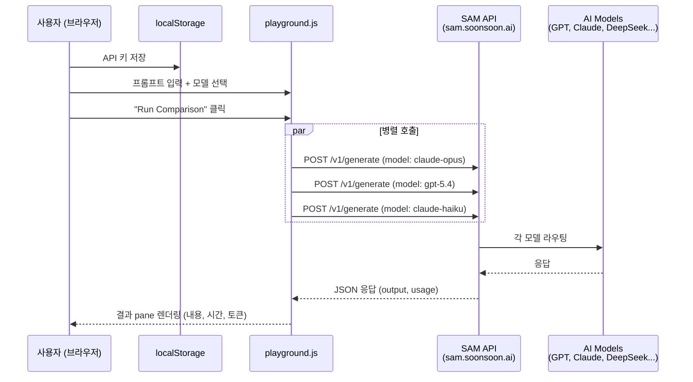
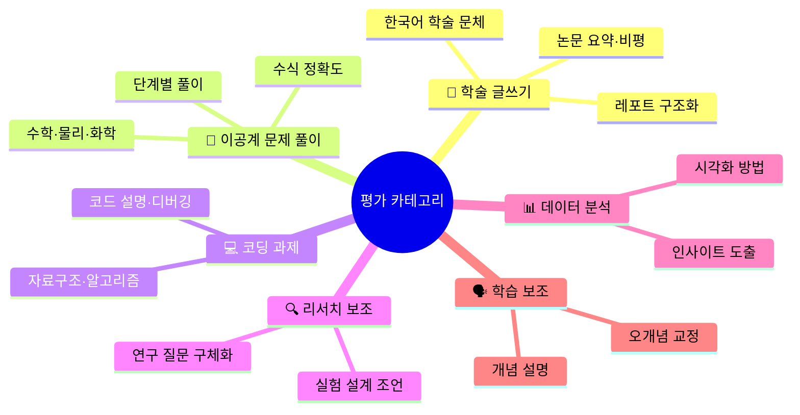

# 📊 wemeet-uni-bench Benchmark Playground 분석 보고서

> **작성일**: 2026-05-20  
> **분석 대상**: `wemeet-uni-bench/website/playground/` — Multi-Model Comparison System  
> **프로젝트**: 서울대학교 WE-Meet × 순순팩토리 AI 벤치마크

---

## 1. 프로젝트 전체 개요

### 1.1 배경 및 목표

**wemeet-uni-bench**는 서울대학교 WE-Meet 산학연계 프로그램 하에서 순순팩토리와 협력하여 개발하는 **한국 대학생 관점의 AI 모델 벤치마크**이다.

> [!IMPORTANT]
> 핵심 문제의식: 기존 LLM 벤치마크(MMLU, HumanEval, GPQA 등)는 해외 AI 연구진 중심으로 설계되어, **한국 대학생이 학업에서 AI를 활용할 때 체감하는 실질적 성능과 괴리**가 있다.

**프로젝트 4대 목표:**
1. 기존 벤치마크 체계 조사·분석
2. 대학생 관점에서 유의미한 평가 파라미터 도출
3. 실제 대학 과제·리서치·시험 시나리오 기반 벤치마크 문제 설계
4. SAM 플랫폼 내 다양한 모델에 대해 벤치마크 실행 및 결과 공개

### 1.2 팀 구성

| 역할 | 이름 | 소속 | 담당 |
|------|------|------|------|
| 멘토 | 송용성 | 순순팩토리 대표 / 강원대 겸임교수 | 기술 자문, 방향 설정 |
| 학생 | 김태운 | 서울대 컴퓨터공학과 2학년 | 벤치마크 조사, 실행 스크립트, 코딩 문제 설계 |
| 학생 | 김호윤 | 서울대 재료공학과 2학년 | 이공계 문제 설계, 결과 분석 및 시각화 |

### 1.3 기술 스택

- **AI 플랫폼**: SAM (Smart AI Multiplexer) by SoonsoonFactory
- **벤치마크 실행**: Python (`httpx`, `argparse`)
- **프론트엔드**: 순수 HTML/CSS/JS (프레임워크 없음)
- **문서화**: Markdown
- **협업**: GitHub Issues & Projects

---

## 2. Playground 시스템 분석

### 2.1 Playground란?

Playground는 **웹 브라우저에서 직접 여러 AI 모델에 동일한 프롬프트를 보내고, 응답을 나란히 비교**할 수 있는 인터랙티브 웹 페이지이다.

> SAM API로 한 번에 여러 모델을 호출하고 결과를 나란히 비교한다. 본인의 학업 문제를 직접 입력하고, 어느 모델이 더 도움이 되는지 체감한다.

**위치**: [website/playground/](../../../website/playground)

### 2.2 구성 파일

| 파일 | 크기 | 역할 |
|------|------|------|
| [index.html](../../../website/playground/index.html) | 8.2KB (206줄) | 페이지 구조 및 UI 레이아웃 |
| [playground.js](../../../website/playground/playground.js) | 7.6KB (206줄) | API 호출 로직, DOM 조작, 이벤트 핸들링 |
| [playground.css](../../../website/playground/playground.css) | 7.5KB (319줄) | 스타일링 (상위 style.css 확장) |

---

## 3. 사용자 플로우 (5단계 구조)

Playground는 **5단계 순차 UI**로 구성되며, 사용자가 단계별로 진행한다:



### STEP 01: SAM API 키 입력
- 사용자의 SAM API 키를 입력받아 **`localStorage`**에 저장
- `sam-` 접두사 검증 수행
- API 키는 외부 서버로 전송되지 않음 (클라이언트 사이드 저장만)
- 키 저장/삭제 기능 제공

### STEP 02: 문제(프롬프트) 입력
- 자유 텍스트 입력 (textarea)
- **3가지 프리셋 프롬프트** 제공:

| 프리셋 | 분야 | 내용 |
|--------|------|------|
| `cs` | 컴공 — 동적계획법 | 최대 부분배열 합 문제 (O(N), Python, 점화식 설명 요구) |
| `mat` | 재료 — 전위 개념 | Edge/Screw dislocation 차이, Burgers vector 설명 요구 |
| `kkodle` | 꼬들 게임 | 한국어 5글자 Wordle, 정보 이론적 관점 첫 추측 |

### STEP 03: 모델 선택 (2~5개)
사용 가능한 **6개 모델**이 카드 UI로 제공:

| 모델 | 등급 | 가격 (입/출 per M tok) | 기본 선택 |
|------|------|------------------------|-----------|
| `claude-opus` | Premium | $5.5 / $27.5 | ✅ |
| `gpt-5.4` | Premium | $2.5 / $15 | ✅ |
| `claude-haiku` | Mid | $1.1 / $5.5 | ✅ |
| `deepseek-v3.2` | Budget | $0.62 / $1.85 | ❌ |
| `glm-4.7-flash` | Budget | $0.06 / $0.40 | ❌ |
| `qwen3-coder-next` | Coding | $0.5 / $1.2 | ❌ |

> [!NOTE]
> 기본 3개가 선택되어 있으며 (Premium 2 + Mid 1), 사용자가 Budget/Coding 등급까지 포함하여 비교할 수 있다.

### STEP 04: 실행 & 비교
- 선택된 모델들에 대해 **병렬(parallel)** API 호출
- 각 모델의 결과 pane이 즉시 생성되며, 로딩 상태 표시
- 완료 시: 응답 내용, 소요 시간(초), 토큰 사용량(in/out) 표시

### STEP 05: 관찰 노트
벤치마크 데이터 수집을 위한 **체크리스트** 제공:
- □ 한국어 학술 문체로 답하는가? (어색한 번역체는 없는가)
- □ 풀이 과정을 단계별로 보여주는가?
- □ 참고할 수 있는 출처/공식을 제시하는가?
- □ 모르는 것을 솔직하게 인정하는가?
- □ 비싼 모델이 정말 더 도움되는가? (가성비)

---

## 4. 기술 아키텍처

### 4.1 데이터 흐름



### 4.2 API 호출 구조

[callModel 함수](../../../website/playground/playground.js#L155-L202)의 핵심 로직:

```javascript
// SAM /v1/generate 엔드포인트 호출
const res = await fetch(`${SAM_BASE_URL}/v1/generate`, {
  method: 'POST',
  headers: {
    'X-API-Key': apiKey,
    'Content-Type': 'application/json',
  },
  body: JSON.stringify({
    model,                                    // 모델 이름
    messages: [{ role: 'user', content: prompt }],  // 단일 유저 메시지
    options: { stream: false },               // 비스트리밍 모드
  }),
});
```

**응답 파싱** — 여러 가능한 응답 구조를 폴백 체인으로 처리:
```javascript
const content =
  data?.output?.content ??                    // SAM 기본 형식
  data?.output?.message?.content ??           // 대안 1
  data?.choices?.[0]?.message?.content ??     // OpenAI 호환 형식
  JSON.stringify(data, null, 2);              // 최후 폴백
```

### 4.3 에러 처리

| 상황 | 처리 방식 |
|------|-----------|
| API 키 없음 | `alert()` + 버튼 비활성화 |
| 프롬프트 비어있음 | `alert()` 경고 |
| 모델 미선택 | `alert()` 경고 |
| 5개 초과 선택 | `alert()` 경고 (최대 5개 제한) |
| HTTP 에러 | pane에 에러 상태(`is-error`) + HTTP 상태코드 표시 |
| 네트워크 에러 | pane에 에러 메시지 표시 |

### 4.4 UI/UX 설계

- **다크 테마** 기반 (상위 `style.css`의 CSS 변수 활용)
- **반응형 레이아웃**: 900px 이하에서 그리드 1열 전환
- 모델 선택 카드는 **체크박스 기반** (CSS `input:checked` 활용한 시각적 피드백)
- 결과 pane에 **상태 인디케이터**: 점멸 dot(로딩), 녹색 dot(완료), 빨간 dot(에러)
- 결과 본문 `max-height: 600px` 스크롤 제한

---

## 5. CLI 벤치마크 실행 스크립트와의 비교

Playground 외에 [run_benchmark.py](../../../scripts/run_benchmark.py)라는 **CLI 기반 자동화 벤치마크 실행 스크립트**도 존재한다.

| 비교 항목 | Playground (웹) | run_benchmark.py (CLI) |
|-----------|-----------------|------------------------|
| **실행 환경** | 브라우저 | Python CLI |
| **입력 방식** | 자유 텍스트 + 프리셋 | JSON 파일 (`benchmarks/categories/`) |
| **모델 선택** | UI 체크박스 (6개 중 선택) | 하드코딩 7개 모델 전부 순차 실행 |
| **실행 방식** | `Promise.allSettled` (병렬) | 순차 실행 (모델별 순서대로) |
| **결과 저장** | 화면 표시만 (저장 없음) | JSON 파일 자동 저장 (`results/`) |
| **Rate Limit** | 미처리 | 재시도 로직 내장 (`retry_after_seconds`) |
| **목적** | 학생이 직접 체험·비교 | 대량 자동 벤치마크 실행 |
| **API 호출** | `fetch()` (브라우저) | `httpx.post()` (Python) |

> [!TIP]
> 두 시스템은 상호 보완적이다. Playground는 **탐색적 사용**(학생이 자기 문제를 던져보고 체감), run_benchmark.py는 **체계적 평가**(사전 정의된 문제 세트 자동 실행 및 결과 축적)에 활용된다.

---

## 6. 평가 체계

[evaluation-criteria.md](../../evaluation-criteria.md)에 정의된 채점 기준:

### 6.1 평가 카테고리 (6개)



### 6.2 채점 루브릭 (4차원)

| 기준 | 비중 | 5점 기준 |
|------|------|----------|
| **정확성** (Correctness) | 40% | 완벽히 정확한 답변 |
| **유용성** (Helpfulness) | 30% | 즉시 과제에 활용 가능 |
| **설명력** (Explainability) | 20% | 단계별 명확한 설명, 학습에 도움 |
| **한국어 품질** (Korean Quality) | 10% | 자연스러운 학술 한국어 |

### 6.3 난이도 체계 (4단계)

| 레벨 | 대상 | 설명 |
|------|------|------|
| L1 | 1학년 | 교양/기초 과목 수준 |
| L2 | 2학년 | 전공 기초 수준 |
| L3 | 3학년 | 전공 심화 수준 |
| L4 | 4학년 | 졸업 프로젝트/대학원 입문 |

---

## 7. 현재 상태 및 관찰

### 7.1 구현 완료 사항
- ✅ Playground 웹 UI 전체 구현 (HTML/CSS/JS)
- ✅ SAM API 연동 및 병렬 호출 로직
- ✅ CLI 벤치마크 실행 스크립트
- ✅ 평가 기준 설계 문서화
- ✅ 프로젝트 소개 웹사이트 (한/영)
- ✅ 예제 벤치마크 문제 1건 (`CD-L2-001`: BST 구현)

### 7.2 미완성/TODO 사항
- ❌ 벤치마크 문제 세트 미구축 (현재 예제 1건만 존재)
- ❌ 벤치마크 실행 결과 없음 (`results/` 디렉토리 비어있음)
- ❌ 자동 채점 시스템 미구현
- ❌ Playground 결과 저장/내보내기 기능 없음
- ❌ 스트리밍 응답 미지원 (현재 `stream: false` 고정)

---

## 8. 개선 제안

### 8.1 기능 개선

| 우선순위 | 제안 | 설명 |
|----------|------|------|
| 🔴 높음 | **결과 저장/내보내기** | Playground 비교 결과를 JSON/CSV로 다운로드 가능하게 하여 벤치마크 데이터 축적 |
| 🔴 높음 | **스트리밍 응답** | `stream: true`로 전환하여 실시간 타이핑 효과 → UX 대폭 개선 |
| 🟡 중간 | **Markdown 렌더링** | 현재 `textContent`로 평문 표시 → Markdown 파서(marked.js 등)로 수식/코드 하이라이팅 |
| 🟡 중간 | **평가 폼 연동** | STEP 05 체크리스트를 실제 입력 가능한 폼으로 만들어 채점 데이터 수집 |
| 🟢 낮음 | **히스토리 기능** | 이전 비교 결과를 localStorage에 저장하여 나중에 다시 볼 수 있게 |
| 🟢 낮음 | **모델 동적 로딩** | SAM API에서 사용 가능한 모델 목록을 동적으로 가져오기 |

### 8.2 코드 품질 개선

> [!WARNING]
> 이전 버전의 `run_benchmark.py`에는 API 키 기본값이 하드코딩되어 있어 보안 위험이 있었다. 현재 버전에서는 `SAM_API_KEY` 환경 변수만 읽도록 수정했다.

```diff
# scripts/run_benchmark.py L18
-SAM_API_KEY = os.getenv("SAM_API_KEY", "YOUR_SAM_API_KEY")
+SAM_API_KEY = os.getenv("SAM_API_KEY")
+if not SAM_API_KEY:
+    print("Error: SAM_API_KEY 환경 변수를 설정하세요.")
+    sys.exit(1)
```

---

## 9. 요약

**Benchmark Playground**는 wemeet-uni-bench 프로젝트의 **사용자 대면(user-facing) 핵심 도구**로, SAM API를 활용하여 여러 AI 모델의 응답을 나란히 비교하는 웹 인터페이스이다.

```
┌─────────────────────────────────────────────────────────┐
│  아키텍처 요약                                            │
│                                                         │
│  [브라우저]                                               │
│   ├── API 키 → localStorage                              │
│   ├── 프롬프트 + 모델 선택                                  │
│   ├── 병렬 fetch() → SAM /v1/generate                    │
│   └── 결과 pane 렌더링 (내용 + 시간 + 토큰)                  │
│                                                         │
│  [SAM Platform]                                         │
│   ├── 단일 엔드포인트 → 30+ 모델 라우팅                      │
│   └── 모델별 가격/성능 정보 제공                              │
│                                                         │
│  [평가 체계]                                               │
│   ├── 6 카테고리 × 4 난이도 = 24 평가 차원                    │
│   └── 4 채점 기준 (정확성 40% + 유용성 30% + 설명력 20% + 한국어 10%) │
└─────────────────────────────────────────────────────────┘
```

프로젝트는 현재 **POC(Proof of Concept) v0.1** 단계로, 핵심 인프라(웹 UI, API 연동, 평가 체계 설계)는 갖추어져 있으나, 실제 벤치마크 문제 세트 구축과 결과 데이터 축적이 다음 단계의 핵심 과제이다.
