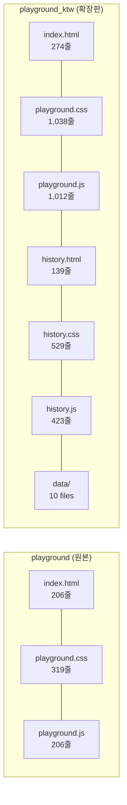

# Playground vs Playground KTW — 비교 분석 보고서

> 작성 기준: 2026-05-21 기준 최신 코드

---

## 1. 개요

| 항목 | `playground` (원본) | `playground_ktw` (확장판) |
|---|---|---|
| 버전 | v0.1 (POC) | v0.2 (KTW) |
| 파일 수 | 3개 | 7개 + `data/` 디렉토리 (10파일) |
| 총 코드 규모 | ~23 KB | ~84 KB |
| HTML | 206줄 (8 KB) | 274줄 (12 KB) |
| CSS | 319줄 (7 KB) | ~1,038줄 (22 KB) |
| JS | 206줄 (8 KB) | ~1,012줄 (33 KB) |
| 추가 페이지 | 없음 | History Viewer (HTML+CSS+JS) |
| 외부 라이브러리 | 없음 | marked.js, Prism.js, KaTeX |

---

## 2. 아키텍처 차이

### `playground` — 단일 페이지, 수직 스크롤 구조

```
index.html (단일 파일)
├── NAV
├── HERO
├── STEP 01: API Key
├── STEP 02: 문제 입력 (textarea + preset buttons)
├── STEP 03: 모델 선택 (하드코딩 6개 checkbox)
├── STEP 04: 실행 & 결과
├── STEP 05: 관찰 노트
└── FOOTER
```

### `playground_ktw` — 사이드바 레이아웃 + 별도 History 페이지

```
index.html
├── NAV (history 링크 포함)
├── pg-layout (sidebar + main)
│   ├── SIDEBAR (탭 전환: Problems / Models)
│   │   ├── Problems 패널
│   │   │   ├── 문제 트리 (JSON 기반 자동 생성)
│   │   │   ├── 직접 입력 버튼
│   │   │   ├── JSON 파일 업로드
│   │   │   └── 문제 상세 정보 (ID, 난이도, 카테고리, 루브릭)
│   │   └── Models 패널
│   │       ├── 프리셋 관리 (저장/불러오기/내보내기/가져오기)
│   │       ├── 태그 필터 칩 (전체/Premium/Mid/Budget/Coding)
│   │       ├── 검색 입력
│   │       └── 동적 모델 리스트 (31개 모델)
│   └── MAIN
│       ├── HERO
│       ├── STEP 01~05 (원본과 동일 구조)
│       └── FOOTER
│
history.html (별도 페이지)
├── SIDEBAR: 실행 기록 목록
└── MAIN: 상세 결과 비교 + 요약 대시보드 + 차트
```

---

## 3. 세부 기능 비교

### 3.1 모델 선택

| 기능 | `playground` | `playground_ktw` |
|---|---|---|
| 모델 수 | 6개 (하드코딩) | 31개 (외부 `data/models.js`) |
| 선택 방식 | HTML checkbox + label | 사이드바 리스트 클릭 → 메인 그리드 반영 |
| 선택/활성 구분 | 없음 (선택 = 활성) | **2중 상태**: `selectedModels`(그리드 표시) + `activeModels`(실제 호출) |
| 모델 검색 | ❌ | ✅ 이름/ID/태그 실시간 검색 |
| 태그 필터 | ❌ | ✅ Premium / Mid / Budget / Coding 칩 필터 |
| 카드 제거 | ❌ | ✅ 카드 우측 상단 ✕ 버튼 |
| 카드 순서 변경 | ❌ | ✅ **Drag & Drop** 재배치 |
| 모델 프리셋 | ❌ | ✅ 이름별 저장/불러오기/삭제, JSON 내보내기/가져오기, 중복 이름 자동 넘버링 `(1)` |

### 3.2 문제 입력

| 기능 | `playground` | `playground_ktw` |
|---|---|---|
| 입력 방식 | textarea 직접 입력 | textarea + 문제 트리 선택 |
| 예제 프롬프트 | 3개 버튼 (cs, mat, kkodle) | 문제 트리에서 JSON 기반 자동 로드 |
| 문제 트리 | ❌ | ✅ 카테고리별 폴더 구조, 클릭 시 자동 프롬프트 주입 |
| 카테고리 한글화 | ❌ | ✅ `category_labels.json` 맵핑, 미등록 키는 영어 폴백 |
| 문제 상세 정보 | ❌ | ✅ ID, 난이도, 카테고리, 목적(purpose), 루브릭(rubric) 표시 |
| JSON 파일 업로드 | ❌ | ✅ 로컬 `.json` 문제 파일 드래그 앤 드롭 또는 클릭 업로드 |
| 선택 상태 뱃지 | ❌ | ✅ 프롬프트 입력 영역 위에 선택된 문제 ID 뱃지 표시 (해제 가능) |

### 3.3 결과 렌더링

| 기능 | `playground` | `playground_ktw` |
|---|---|---|
| 텍스트 출력 | `textContent` (플레인 텍스트) | **Markdown 렌더링** (marked.js) |
| 코드 하이라이팅 | ❌ | ✅ Prism.js (자동 언어 감지) |
| 수식 렌더링 | ❌ | ✅ KaTeX (`$...$`, `$$...$$`) |
| 결과 저장 | ❌ | ✅ JSON 다운로드 버튼 |
| DB 저장 | ❌ | ✅ 로컬 서버 API(`/api/save_result`)로 자동 저장 |
| localStorage 캐시 | ❌ | ✅ 최근 실행 결과를 `playground_last_run`에 저장 |
| History 링크 | ❌ | ✅ "결과 자세히 보기" 버튼 → `history.html?run=latest`로 이동 |

### 3.4 History Viewer (KTW 전용)

| 기능 | `playground` | `playground_ktw` |
|---|---|---|
| History 페이지 | ❌ 없음 | ✅ 별도 `history.html` |
| DB 동기화 | — | ✅ `/api/results` API 호출로 서버 DB 목록 불러오기 |
| JSON 파일 드롭 | — | ✅ 로컬 JSON 파일 드래그 앤 드롭 조회 |
| 상세 뷰 | — | ✅ 프롬프트 + 모델별 답변 카드 나란히 비교 |
| Markdown 렌더링 | — | ✅ 답변을 Markdown → HTML로 변환하여 표시 |
| **요약 대시보드** | — | ✅ Max/Min Latency, Total Tokens (In/Out) |
| **비교 차트** | — | ✅ 모델별 응답 시간 & 출력 토큰 수 가로 막대 그래프 |
| Lazy Loading | — | ✅ 목록은 요약만 로드, 클릭 시 상세 데이터 추가 로드 |

### 3.5 UI/UX

| 기능 | `playground` | `playground_ktw` |
|---|---|---|
| 레이아웃 | 수직 스크롤 (단일 컬럼) | **사이드바 + 메인** (2컬럼 레이아웃) |
| 사이드바 접기 | ❌ | ✅ ◀ 토글 버튼 (축소 시 아이콘만 표시) |
| 탭 전환 | ❌ | ✅ Problems ↔ Models 탭 |
| 반응형 대응 | 기본적 (`@media 900px`) | 확장된 반응형 (사이드바 축소, 그리드 재배치) |
| 마이크로 인터랙션 | hover 정도 | hover, active 칩 강조, 드래그 시각 피드백, 트랜지션 |

---

## 4. 데이터 관리 비교

| 항목 | `playground` | `playground_ktw` |
|---|---|---|
| 모델 데이터 | HTML에 직접 하드코딩 | `data/models.js` 외부 파일 (31개 모델) |
| 문제 데이터 | JS 내 `PRESETS` 객체 (3개) | `data/problems.json` 인덱스 + 개별 JSON 파일들 |
| 카테고리 라벨 | ❌ | `data/category_labels.json` (12개 카테고리 한글 맵핑) |
| 실행 결과 저장 | ❌ | `benchmarks/results/` 디렉토리 (서버 API 경유) |
| 프리셋 저장 | ❌ | `localStorage` (`playground_model_presets` 키) |
| API 키 저장 | `localStorage` | `localStorage` (동일) |

---

## 5. 기술 스택 차이

| 항목 | `playground` | `playground_ktw` |
|---|---|---|
| HTML/CSS/JS | Vanilla (의존성 없음) | Vanilla + CDN 라이브러리 3종 |
| Markdown | ❌ | marked.js v15 |
| Syntax Highlighting | ❌ | Prism.js v1.30 + Autoloader |
| 수학 수식 | ❌ | KaTeX v0.16.22 + auto-render |
| 백엔드 서버 | ❌ (순수 프론트엔드) | Python `http.server` 기반 로컬 서버 (`scripts/server.py`) |
| API 연동 | SAM `/v1/generate` 직접 호출 | SAM `/v1/generate` + 로컬 `/api/save_result`, `/api/results` |

---

## 6. 코드 규모 비교



| 측정 항목 | `playground` | `playground_ktw` | 증가율 |
|---|---|---|---|
| JS 총 라인 수 | 206줄 | 1,435줄 (playground + history) | **~7x** |
| CSS 총 라인 수 | 319줄 | 1,567줄 | **~5x** |
| HTML 총 라인 수 | 206줄 | 413줄 (playground + history) | **~2x** |
| 총 바이트 | ~23 KB | ~84 KB | **~3.6x** |

---

## 7. 요약

`playground`는 SAM API를 활용한 최소 기능 시제품(POC)으로, **모델 6개를 체크박스로 골라 결과를 나란히 보여주는 것**에 집중합니다. 코드가 간결하고 외부 의존성이 없으며, 빠르게 개념을 검증하기에 적합합니다.

`playground_ktw`는 이 POC를 기반으로 **실제 벤치마크 워크플로우에 필요한 모든 기능**을 체계적으로 확장한 버전입니다. 핵심 차이점을 한 줄로 요약하면:

> **"하드코딩된 6개 모델 비교 도구"** → **"31개 모델을 프리셋으로 관리하고, 문제를 트리에서 선택하며, 결과를 Markdown으로 렌더링하고, 히스토리에서 차트로 비교 분석하는 벤치마크 플랫폼"**

### 주요 확장 포인트 (KTW에만 있는 기능)
1. 📂 **문제 트리** — JSON 기반 카테고리 탐색, 파일 업로드, 한글 라벨
2. 🤖 **동적 모델 관리** — 31개 모델, 검색, 태그 필터, Drag & Drop 재배치
3. 🔖 **프리셋 시스템** — 모델 세트 저장/불러오기/내보내기
4. 📝 **Markdown/코드/수식 렌더링** — marked.js + Prism.js + KaTeX
5. 💾 **결과 영속 저장** — 로컬 서버 DB + JSON 다운로드 + localStorage
6. 📜 **History Viewer** — 별도 페이지, DB 동기화, 요약 대시보드, 비교 차트
